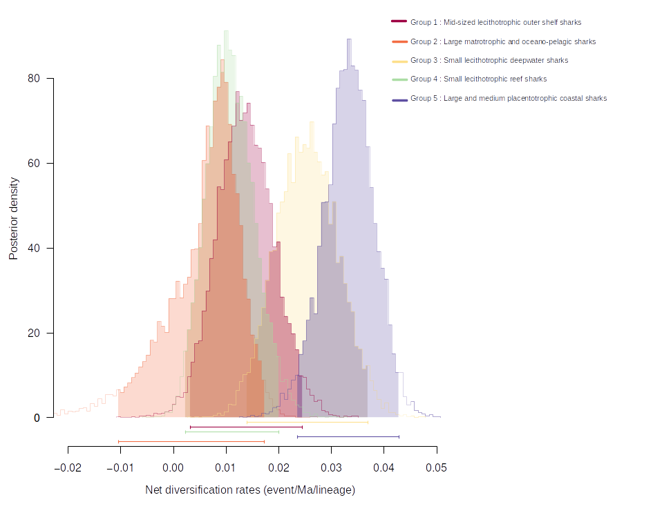
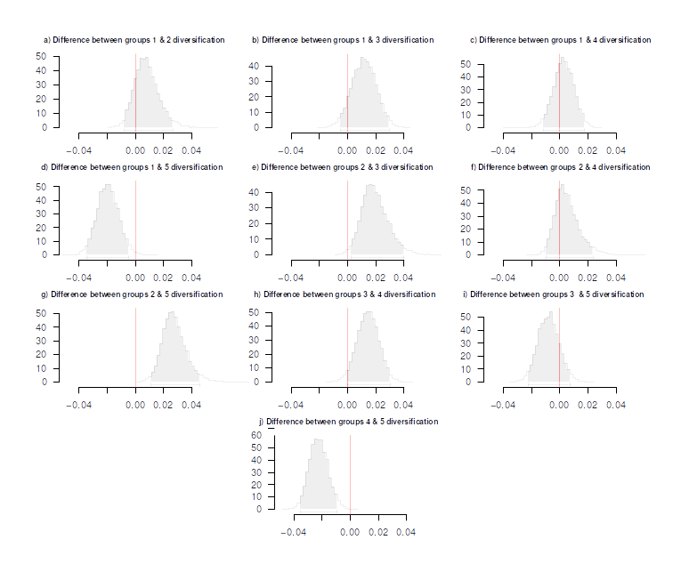

 # Tempo and mode of trait evolution across the shark Tree of Life: repository 

## Summary 

- [Summary](#Summary)
- [Overview](#Overview)
- [1 Modeling trait evolution](#1-Modeling-trait-evolution)
	- [1.1 Data cleaning and model construction](#11-Data-cleaning-and-model-construction)
	- [1.2 Selecting the likeliest model](#12-Selecting-the-likeliest-model)
	- [1.3 Ancestral state estimation](#13-Ancestral-state-estimation)
- [2 Diversification analyses](#2-Diversification-analyses)
	- [3.1 Revisiting MuSSE analysis](#31-Revisiting-MuSSE-analysis)
	- [3.2 Testing a single multi-state trait](#32-Testing-a-single-multi-state-trait)
	- [3.3 Testing multiple binary traits](#33-Testing-multiple-binary-traits)
- [2 Sensitivity analyses](#3-Sensitivity-analyses)
	- [3.1 Revisiting MuSSE analysis](#31-Revisiting-MuSSE-analysis)
	- [3.2 Testing a single multi-state trait](#32-Testing-a-single-multi-state-trait)
	- [3.3 Testing multiple binary traits](#33-Testing-multiple-binary-traits)
- [Reference](#Reference)

 This repository's purpose is to give a means of replicability to the article "Tempo and mode of trait evolution across the shark Tree of Life" but can be generalized to other similar data as the scripts are not specific. All of the presented scripts are written in R language (R Core Team, 2022). If you plan to use any of these scripts, please cite "Marion et al., 2024". 

## Overview

 This repository contains scripts and html files for performing the following comparative analyses:

**1**: Modeling trait evolution

**2**: Analyses of diversification

**3**: Sensitivity analyses

 Example data used for our article are available at "figshare.com".

## 1 Modeling trait evolution

`package requirement (corHMM, mclust, string, phytools, qpcR, ggtree, secsse)`

`used script (corHMM_script.r/corHMM_ASE_script.r)`

  The purpose of this analysis is twofold. First, we want to test how traits evolved and what evolutionary scenario they followed. Second, using corHMM output we will perform which can be later compared with the ancestral state estimation from SecSSE

### 1.1 Data cleaning and model construction

 The first step in any comparative analysis is to clean and prepare the trait data. To do so, we must extract and isolate such values in a vector. As maximum body size is continuous data, we may want to discretize it. In this script, we use a Gaussian mixture model with the mclust function of the mclust package to cluster continuous data. This package automatically selects the most likely number of groups. Then, we name each trait value according to its species name.

The second step is to build the actual evolutionary model we want to test. Usually, three models are tested when performing trait evolution analyses: an equal rate, a symmetric rate (transition from A to B is the same that B to A), and an all rates differ, which is self-explanatory. However, such models may not be adequate when testing specific evolutionary scenarios. For example, we may want to test whether the direct transition from small size to large size is impossible. To do so we create a custom transition matrix by indicating that direct transitions between opposed states are impossible. In our case of Shark evolution, all these models will be referred to from now on as "sequential models", namely if one wants to go from A to C, there are two transitions, A to B, and B to C. Each model parameter specification was then entered in a standardised corrHMM fashion. To properly model trait evolution, one should always keep in mind that evolutionary rates may vary across the phylogeny, thus it is best practice to introduce another parameter, the "rate" parameter. This parameter allows for heterogeneity of transition rates across the phylogeny, that is if one part of the phylogeny has short branching patterns as opposed to the rest of the tree, corHMM will take into account such heterogeneity, regardless of the trait state. Introducing such parameters is a great way to avoid false positives but is also very resource-consuming as these models are parameters rich (often more than twice the number of parameters for a one-rate model). To keep the likelihood space to allow and avoid over-parametrization, we did not go as far as 3 rates.

 

### 1.2 Selecting the likeliest model

 Then, we may perform each model and save relevant metrics for comparison. This script saves each model output into a data frame filled with the log-likelihood, the AICc, the $\Delta$AICc, and the $\omega$AICc.
We then automatically save the output from the best-fitting model for each trait.
 

### 1.3 Ancestral state estimation

 Lastly, one may be interested in estimating the ancestral condition for his clade of interest. Fortunately, corHMM jointly estimates transition rates and ancestral states, thus it is pretty easy to 
	However, ancestral state estimations are and remain **estimations** , thus one should always interpret them with utmost care. 
 

    

## 2 Modeling trait evolution

`package requirement (corHMM, mclust, string, phytools, qpcR, ggtree, secsse)`

`used script (corHMM_Trait.r)`

 The second script . The purpose of this analysis is twofold. First, we want to test how traits evolved and what evolutionary scenario they followed. Second, by already estimating transition rates here, we may be able to put more structure when performing trait-dependent diversification analyses (see below) and thus avoid over-parametrization issues. 

### 2.1 Custom matrix

 The first step here is to build a custom transition matrix. Usually, three models are tested when performing trait evolution analyses: an equal rate, a symmetric rate (transition from A to B is the same that B to A), and an all rate differ. However, such models may not be adequate enough when testing specific evolutionary scenarios. For example, we may want to test whether the direct transition from small size to large size is impossible. To do so we create a custom transition matrix by indicating that direct transitions between opposed states are impossible.  

### 2.2 Building models

 The second step consists in running the best maximum likelihood model into a bayesian framework. To do so, we need to reference priors, as they are mandatory for bayesian analyses. We decided to make an exponential prior, and a run of 10000 generations with 10 % burn-in. To see if convergence was achieved, we visualized the likelihood plot minus the burn-in period. Since the likelihood seems to have stabilized shortly after the burn-in, we considered that this run has converged. 

 Secondly, we plotted the net diversification rates for each pair of trait and the pairwise net diversification rate difference between each trait. The first plot allows the user to visualize easily the range of net diversification rate for each trait. This plot is very qualitative and cannot account for real statistical differences, and hence, it is needed to characterize quantitatively the difference between rates.

    

 The second plot accounts for such differences, as they are significant if the plot does not overlap 0 (represented by a red line). Here we can see two main groups, with respectively low and high net diversification rates. 

    

### 2.3 Assessing the best-fit model across all combinations

 The last step of this analysis is to compute the relative fit of each model with the AICC. Then a data frame, with all relevant information regarding the fit of each model, is built. 

## 3 Sensitivity analyses 

 SSE models are sensitive to several mathematical biases (such as rejection of the null hypothesis). We carried out two additional analyses, to minimize such biases. 

#### 3.1 Revisiting MuSSE analysis

`package requirement (ape, secsse, DDD, tidyverse, parallel, qgraph, optional(stringr))`

`used script (SecSSE_Full.r)`

Accounting for trait effect is subject to numerous methodological biases (Beaulieu and Donoghue, 2013). Indeed, SSE models can falsely indicate an effect of the focal trait on diversification. Models with hidden traits, such as SeCSSE (Herrera-Alsina et al., 2019) or HiSSE (Beaulieu and O'Meara, 2016) can account for hidden variables in trait-dependant diversification. Here we use SeCSSE to detect : 

1 - an effect of the trait on diversification, 

2 - the possible existence of other hidden variables in our dataset (other variables than the trait-association variable).

3 - the coexistence of focal and hidden variables in our dataset (trait-association and hidden variables). 

#### 3.2 Testing a single multi-state trait

`package requirement (ape, secsse, DDD, tidyverse, parallel, qgraph, optional(stringr))`

`used script (SecSSE_Reproduction.r, SecSSE_Body-size.r)`

Individual trait analyses were conducted reuse the same archetype as for the trait-association variable.

  

#### 3.3 Testing multiple binary traits

`package requirement (diversitree, qpcR, optional(stringr))`

`used script (Multi_State_MUSSE.r)`

 As habitat is hardly discriminable, the most efficient way to account for, this trait was to subdivide it into several binary traits, with one state being the presence of a species in a certain habitat, and the other its absence. Because of its nature, such a trait could not be analyzed with the previous method. Consequently, we used the function musse.multitrait presented in the package diversitree. Using the same dataset as before and with multitrait_binary_analysis.r script, you will be able to conduct this analysis.  

 The second step consists in running the best maximum likelihood model into a bayesian framework. To do so, we need to reference priors, as they are mandatory for bayesian analyses. We decided to make an exponential prior, and a run of 10000 generations with 10 % burn-in. To see if convergence was achieved, we visualized the likelihood plot minus the burn-in period. Since the likelihood seems to have stabilized shortly after the burn-in, we considered that this run has converged. 

 Secondly, we plotted the net diversification rates for each pair of trait and the pairwise net diversification rate difference between each trait. The first plot allows the user to visualize easily the range of net diversification rate for each trait. This plot is very qualitative and cannot account for real statistical differences, and hence, it is needed to characterize quantitatively the difference between rates.

### Reference

Beaulieu, J. M. Donoghue, M. J. (2013). Fruit evolution and diversification in campanulid angiosperms: Campanulid fruit evolution. Evolution. 67(11): 3132-3144.

Herrera-Alsina, L. van Els, P. Etienne, R. S. (2019). Detecting the dependence of diversification on multiple traits from phylogenetic trees and trait data. Systematic Biology. 68(2): 317-328.

Liedtke, H. C. Wiens, J. J. & Gomez-Mestre, I. (2022). The evolution of reproductive modes and life cycles in amphibians. Nature Communications, 13(1): 1-15.

Maddison, W.P., Midford, P.E. & Otto, S.P. (2007) Estimating a binary character's effect on speciation and extinction. Systematic Biology, 56, 701–710

Menardi, G. (2011). Density-based Silhouette diagnostics for clustering methods. Statistics and Computing. 21(3): 295-308.

Mérigot, B. Durbec, J. P. Gaertner, J. C. (2010). On goodness-of-fit measure for dendrogram-based analyses. Ecology. 91(6): 1850-1859.

R Core Team (2022). R: A language and environment for statistical
computing. R Foundation for Statistical Computing, Vienna, Austria.
URL https://www.R-project.org/.

Zambelli, A. E. (2016). A data-driven approach to estimating the number of clusters in hierarchical clustering. F1000 Research 5: 2809.
